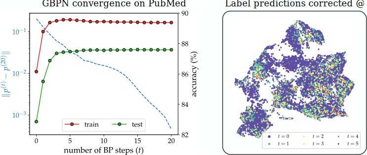

# Graph Belief Propagation Networks

The graph belief propagation networks (GBPNs) is a family of graph neural networks models for node classification.
They are accurate, interpretable, and converge to a stationary solution as the number of BP steps increase.




## Environment Setup

The implementations in this repository are tested under Python 3.8, PyTorch version 1.6.0, and Cuda 10.2.
To setup the environment, simply run the following:

```setup
bash install_requirements.sh
```

This command installs PyTorch Geometric, and compiles the sub-sampling algorithm written in C++.
Note PyTorch Geometric may fail to initialize ([issue](https://github.com/rusty1s/pytorch_geometric/issues/999)) if there are multiple versions of PyTorch installed.
Therefore, we highly recommend the users to start with a new conda environment.

## Basic Usage

A GBPN model consists of a MLP that maps features on each node to its self-potential, and a coupling matrix.
It can be defined in the same way as any PyTorch Module.

```python
model = GBPN(num_features, num_classes, dim_hidden=dim_hidden, num_layers=num_layers, activation=nn.ReLU(), dropout_p=dropout_p, lossfunc_BP=0, deg_scaling=False, learn_H=True)
```

Here, the MLP has input dimension _num\_features_, output dimension _num\_classes_, and hidden dimension _dim\_hidden_


>📋  Describe how to train the models, with example commands on how to train the models in your paper, including the full training procedure and appropriate hyperparameters.

## Evaluation

To evaluate my model on ImageNet, run:

```eval
python eval.py --model-file mymodel.pth --benchmark imagenet
```

>📋  Describe how to evaluate the trained models on benchmarks reported in the paper, give commands that produce the results (section below).

## Pre-trained Models

You can download pretrained models here:

- [My awesome model](https://drive.google.com/mymodel.pth) trained on ImageNet using parameters x,y,z. 

>📋  Give a link to where/how the pretrained models can be downloaded and how they were trained (if applicable).  Alternatively you can have an additional column in your results table with a link to the models.

## Results

Our model achieves the following performance on :

### [Image Classification on ImageNet](https://paperswithcode.com/sota/image-classification-on-imagenet)

| Model name         | Top 1 Accuracy  | Top 5 Accuracy |
| ------------------ |---------------- | -------------- |
| My awesome model   |     85%         |      95%       |

>📋  Include a table of results from your paper, and link back to the leaderboard for clarity and context. If your main result is a figure, include that figure and link to the command or notebook to reproduce it. 


## Contributing

>📋  Pick a licence and describe how to contribute to your code repository. 
